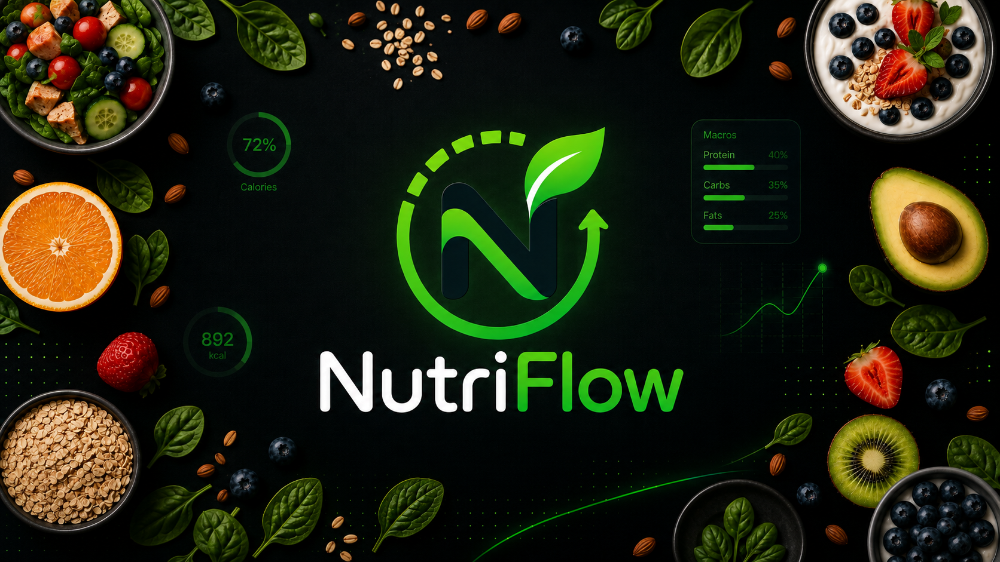

<p align="center">
  
</p>

<h1 align="center">NutriFlow</h1>

<p align="center">
  <strong>Nutrición, hábitos y progreso en una experiencia móvil moderna.</strong>
</p>

<p align="center">
  
  
  
  
</p>

<p align="center">
  <a href="https://github.com/Jairo0811/NutriFlow/actions/workflows/ci.yml">
    
  </a>
  
  
</p>

<p align="center">
  <strong>React Native · Expo · TypeScript · ASP.NET Core · EF Core · PostgreSQL · Docker · GitHub Actions</strong>
</p>

> 🎓 **Origen académico:** NutriFlow parte de un conjunto de mockups desarrollado durante la asignatura **Bases de Datos 1 (INF-164)** de la **Universidad APEC (UNAPEC)**, en el período **Mayo - Agosto 2024**. En aquella etapa no se desarrolló una aplicación funcional. La versión actual toma ese prototipo como referencia conceptual y visual y construye por primera vez el producto como una aplicación móvil full-stack.

---

## 📖 Descripción

**NutriFlow** es una aplicación móvil de seguimiento nutricional orientada a ayudar a las personas a registrar su alimentación, visualizar calorías y macronutrientes, establecer objetivos personales y analizar su progreso desde una experiencia clara, segura y consistente.

El proyecto actual **no es una migración ni una refactorización de una aplicación anterior**. La entrega académica de 2024 consistió exclusivamente en **mockups de prototipo** que representaban cómo podría funcionar una futura aplicación de nutrición.

En 2026 se retoma esa idea para convertirla en software real, desarrollando desde cero:

- aplicación móvil con React Native y Expo;
- API REST con ASP.NET Core;
- persistencia relacional con Entity Framework Core y PostgreSQL;
- autenticación, sesiones y recuperación de acceso;
- lógica nutricional;
- integración futura con cámara y códigos de barras;
- analítica de progreso;
- infraestructura reproducible con Docker;
- integración continua y controles de seguridad de dependencias.

La meta es evolucionar el concepto universitario hasta convertirlo en un proyecto de portafolio con calidad suficiente para continuar hacia un producto real.

---

## 🕰️ Evolución del proyecto

```text
2024 — UNAPEC · INF-164
        │
        ├── Concepto de producto
        ├── Flujo de usuario
        └── Mockups de prototipo
                │
                │ Sin aplicación funcional
                │ Sin backend
                │ Sin API
                │ Sin implementación móvil
                ▼
2026 — NutriFlow
        │
        ├── React Native + Expo
        ├── ASP.NET Core
        ├── Entity Framework Core
        ├── PostgreSQL
        ├── Docker
        └── GitHub Actions
                │
                ▼
        Aplicación móvil full-stack
```

Esta separación conserva el valor histórico del trabajo universitario sin atribuirle implementaciones que no existieron en la entrega original.

---

## 🎓 Origen académico

El concepto que da origen a NutriFlow fue preparado como proyecto de **Bases de Datos 1 (INF-164)** en la **Universidad APEC (UNAPEC)**.

Durante aquella etapa el equipo produjo **mockups que definían visualmente la propuesta**, incluyendo pantallas para registro, perfil físico, nivel de actividad, preferencias alimentarias, objetivos, dashboard nutricional, comidas, escaneo y progreso.

Esas pantallas eran una **representación de funcionalidades propuestas**, no funcionalidades implementadas en software.

### 📚 Información académica

| Información | Detalle |
|---|---|
| 📖 Asignatura | Bases de Datos 1 (INF-164) |
| 👨‍🏫 Profesor | Ing. Pedro José Ramirez Rodriguez |
| 🏫 Institución | Universidad APEC (UNAPEC) |
| 📅 Período académico | Mayo - Agosto 2024 |
| 📁 Entrega original | Prototipo mediante mockups |
| 🎨 Prototipo | [Figma — Daiet](https://www.figma.com/proto/Ww6fj3ebznHPc88hr48FSg/Daiet?node-id=0-1&t=U2MHmy9fFjnzx23I-1) |
| 💻 Aplicación funcional en 2024 | No |
| 📱 Implementación actual | Aplicación móvil full-stack desarrollada desde cero |

### 👥 Equipo académico original

| 👤 Integrante | 🆔 Matrícula |
|---|---|
| Luis Alberto Jimenez Perez | A00102205 |
| Charlie de Leon Duran | A00108707 |
| Francisca Mariela Hernández Melo | A00113127 |
| Francis Jairo Matías Rosario | A00115261 |

---

## 🎨 Prototipo académico original en Figma

Los **mockups y el prototipo interactivo originales de 2024** se conservan en Figma y constituyen la **fuente visual de referencia del proyecto académico**. El diseño documenta la navegación, jerarquía de pantallas, textos, componentes y concepto de experiencia de usuario que dieron origen a NutriFlow.

<p align="center">
  <a href="https://www.figma.com/proto/Ww6fj3ebznHPc88hr48FSg/Daiet?node-id=0-1&t=U2MHmy9fFjnzx23I-1">
    
  </a>
</p>

Entre las pantallas identificadas en el prototipo se encuentran:

| Pantalla original | Propósito conceptual |
|---|---|
| `Inicio` | Presentación y entrada al flujo |
| `Log in` | Inicio de sesión |
| `Sign in` | Creación de cuenta |
| `Actividad física` | Datos físicos, demográficos y nivel de actividad |
| `Alimentos` | Selección de preferencias alimentarias |
| `Alimentos v2` | Concepto de escaneo de alimentos |
| `Objetivo` | Perder grasa, mantener peso o aumentar masa muscular |
| `Main Page` | Dashboard de calorías, macros y comidas |
| `Alergias y preferencias` | Restricciones y alimentos no recomendados |
| `Progreso` | Peso, objetivo y evolución semanal |

> **Importante:** el archivo de Figma representa un **prototipo académico**, no una aplicación funcional. La implementación móvil actual no busca copiarlo literalmente: conserva su intención, flujo e identidad conceptual, mientras moderniza UI/UX, accesibilidad, arquitectura y comportamiento para convertirlo en un producto real.

Para el desarrollo actual, Figma funciona como referencia primaria del diseño original; la nueva interfaz de NutriFlow se implementa con **React Native + Expo** siguiendo los estándares y decisiones técnicas de la versión 2026.

---

## 🔗 Continuidad académica

NutriFlow permite documentar una continuidad docente que se extiende durante varios años dentro de la trayectoria académica en UNAPEC.

| Tipo de continuidad | Coincidencia | Proyecto relacionado |
|---|---|---|
| 👨‍🏫 Profesor recurrente | **Ing. Pedro José Ramirez Rodriguez** | [Digital Sanctuary](https://github.com/Jairo0811/DigitalSanctuary) — Desarrollo de Software con Tecnología Propietaria 2 (ISO-710) |
| 🕰️ Continuidad temporal | **2024 → 2026** | El mismo profesor reaparece dos años después en otra etapa del plan de estudios |

El vínculo conecta **Bases de Datos 1 (INF-164)**, cursada en **Mayo - Agosto de 2024**, con **Desarrollo de Software con Tecnología Propietaria 2 (ISO-710)**, cursada en **Mayo - Agosto de 2026**. Esto refleja continuidad académica con el mismo docente en áreas distintas: fundamentos de datos y desarrollo de software.

> Entre los equipos documentados en estos proyectos no se registra, por ahora, un compañero recurrente que pueda verificarse de forma inequívoca mediante **nombre y matrícula**.

---

## 🧩 Funcionalidades representadas en los mockups originales

El prototipo académico planteaba:

- registro e inicio de sesión;
- captura de sexo, fecha de nacimiento, altura y peso;
- selección del nivel de actividad física;
- preferencias alimentarias;
- alergias y restricciones;
- selección de alimentos;
- objetivos para perder grasa, mantener peso o aumentar masa muscular;
- dashboard de calorías y macronutrientes;
- organización de desayuno, almuerzo, cena y otras comidas;
- concepto de escaneo de alimentos;
- seguimiento de peso y progreso.

> Estas características describen lo **representado en los mockups de 2024**. Su implementación real pertenece al desarrollo actual de NutriFlow.

---

## 🎯 Visión del producto actual

| Necesidad | Respuesta de NutriFlow |
|---|---|
| Registrar lo que se consume diariamente | Diario estructurado de comidas, alimentos y porciones |
| Entender calorías y macronutrientes | Dashboard con objetivos, consumo y valores restantes |
| Adaptar la nutrición al usuario | Perfil físico, actividad, objetivo, alergias y preferencias |
| Registrar productos con rapidez | Búsqueda y escaneo mediante código de barras |
| Medir la evolución | Historial, peso, adherencia y analítica temporal |

### Principios del producto

- **Mobile-first:** la experiencia principal está diseñada para teléfonos.
- **Datos estructurados:** los cálculos nutricionales no dependen de texto libre.
- **Privacidad por diseño:** los datos personales y nutricionales requieren controles adecuados.
- **Dominio independiente:** las reglas de negocio no dependen de frameworks o persistencia.
- **Evolución incremental:** cada capacidad se incorpora mediante fases y pull requests.
- **Mantenibilidad:** Clean Code, SOLID, DRY, KISS y separación de responsabilidades.

---

## 🔐 Fase 1 — Authentication & Identity

La Fase 1 incorpora por primera vez identidad y sesiones funcionales en NutriFlow.

### Backend

- registro con correo, nombre y contraseña;
- login mediante correo y contraseña;
- contraseñas derivadas con **PBKDF2 + SHA-256**, salt individual y comparación segura;
- contraseñas de al menos 12 caracteres con requisitos de complejidad;
- access tokens JWT de corta duración;
- refresh tokens opacos y rotativos;
- almacenamiento exclusivo del **hash** de refresh tokens y tokens de recuperación;
- cierre de sesión mediante revocación;
- recuperación de contraseña con token de un solo uso y expiración;
- revocación de sesiones activas al cambiar la contraseña;
- Google Sign-In mediante verificación del ID token en backend;
- persistencia de usuarios y sesiones con EF Core + PostgreSQL;
- migración inicial del esquema de identidad;
- endpoint autenticado para consultar la identidad actual.

### Aplicación móvil

- pantalla de inicio de sesión;
- pantalla de registro;
- recuperación de contraseña;
- restablecimiento de contraseña;
- integración de Google OAuth preparada para configuración por entorno;
- `AuthProvider` centralizado;
- almacenamiento de sesión mediante Expo SecureStore;
- restauración de sesión al iniciar la aplicación;
- renovación de access token utilizando refresh token;
- cierre de sesión;
- primera área protegida para validar el flujo autenticado.

### Endpoints

| Método | Endpoint | Uso |
|---|---|---|
| `POST` | `/api/auth/register` | Crear una cuenta |
| `POST` | `/api/auth/login` | Iniciar sesión |
| `POST` | `/api/auth/refresh` | Rotar sesión y renovar access token |
| `POST` | `/api/auth/logout` | Revocar refresh token |
| `POST` | `/api/auth/forgot-password` | Solicitar recuperación |
| `POST` | `/api/auth/reset-password` | Establecer nueva contraseña |
| `POST` | `/api/auth/google` | Autenticación mediante Google |
| `GET` | `/api/auth/me` | Consultar identidad autenticada |

> En desarrollo, el token de recuperación puede devolverse para facilitar pruebas locales. En producción deberá entregarse mediante un proveedor transaccional y nunca exponerse en la respuesta HTTP.

---

## ✨ Alcance funcional de la primera versión estable

- autenticación y gestión de sesiones;
- perfil físico y nutricional;
- onboarding de objetivos;
- cálculo de TMB y TDEE;
- objetivos diarios de calorías y macronutrientes;
- catálogo de alimentos;
- registro de comidas y porciones;
- dashboard diario;
- escaneo de código de barras;
- historial de peso y progreso;
- alergias, restricciones y preferencias.

### Evolución posterior

- hidratación diaria;
- recetas y comidas frecuentes;
- favoritos y duplicación de comidas;
- creación manual de alimentos y recetas;
- historial y calendario nutricional;
- seguimiento de micronutrientes;
- comparación de productos;
- lista de compras;
- recomendaciones según macros restantes;
- objetivos intermedios;
- reportes y exportación de datos;
- funcionamiento offline y sincronización;
- integración futura con profesionales de nutrición.

> La inteligencia artificial, si se incorpora en etapas futuras, será una capa complementaria. Los cálculos de calorías, macronutrientes, TMB, TDEE y restricciones permanecerán basados en reglas determinísticas y datos estructurados.

---

## 🧱 Stack tecnológico

### 📱 Aplicación móvil

<p>
  
  
</p>

| Área | Tecnología |
|---|---|
| Framework | React Native 0.86 |
| Plataforma | Expo SDK 57 |
| Lenguaje | TypeScript 6 |
| Navegación | Expo Router |
| Sesiones locales | Expo SecureStore |
| OAuth | Expo AuthSession |
| Organización | Feature-based modular |

### ⚙️ Backend

<p>
  
</p>

| Área | Tecnología |
|---|---|
| Plataforma | .NET 10 |
| API | ASP.NET Core Web API |
| Arquitectura | Clean Architecture |
| Persistencia | Entity Framework Core + Npgsql |
| Autenticación | JWT + refresh tokens rotativos |
| Federación | Google ID token verification |
| Contrato HTTP | OpenAPI |
| Observabilidad inicial | Health Checks |

### 🗄️ Datos e infraestructura

<p>
  
</p>

- **PostgreSQL 17:** base de datos relacional principal.
- **Docker Compose:** infraestructura local reproducible.
- **Git y GitHub:** control de versiones y colaboración.
- **GitHub Actions:** build, pruebas, type-check y auditoría de dependencias.

---

## 🏗️ Arquitectura

```text
┌──────────────────────────────┐
│ React Native + Expo          │
│ NutriFlow Mobile             │
└──────────────┬───────────────┘
               │ HTTPS / JSON
               ▼
┌──────────────────────────────┐
│ ASP.NET Core Web API         │
│ NutriFlow.Api                │
└──────────────┬───────────────┘
               │
               ▼
┌──────────────────────────────┐
│ Application                  │
│ Casos de uso y contratos     │
└──────────────┬───────────────┘
               │
               ▼
┌──────────────────────────────┐
│ Domain                       │
│ Entidades y reglas           │
└──────────────┬───────────────┘
               │
               ▼
┌──────────────────────────────┐
│ Infrastructure               │
│ EF Core / PostgreSQL         │
└──────────────────────────────┘
```

### Dependencias del backend

```text
NutriFlow.Api
   ├── NutriFlow.Application
   └── NutriFlow.Infrastructure

NutriFlow.Infrastructure
   ├── NutriFlow.Application
   └── NutriFlow.Domain

NutriFlow.Application
   └── NutriFlow.Domain
```

`NutriFlow.Domain` permanece independiente de HTTP, persistencia, frameworks y servicios externos.

La documentación arquitectónica se encuentra en [`docs/architecture`](docs/architecture/README.md).

---

## 📂 Estructura del repositorio

```text
NutriFlow/
├── apps/
│   ├── mobile/
│   │   ├── app/
│   │   ├── src/features/auth/
│   │   └── package.json
│   │
│   └── api/
│       └── src/
│           ├── NutriFlow.Api/
│           ├── NutriFlow.Application/
│           ├── NutriFlow.Domain/
│           └── NutriFlow.Infrastructure/
│
├── tests/
│   └── NutriFlow.Application.Tests/
│
├── docs/
│   └── architecture/
│
├── .github/workflows/ci.yml
├── .env.example
├── SECURITY.md
├── docker-compose.yml
└── README.md
```

---

## ✅ Estado actual

La **Fase 1 — Authentication & Identity** está implementada, validada por CI e integrada en `main`.

| Componente | Estado |
|---|:---:|
| Mockups académicos de referencia | ✅ |
| Prototipo original en Figma documentado | ✅ |
| Identidad visual NutriFlow | ✅ |
| Foundation / monorepo | ✅ |
| React Native + Expo | ✅ |
| ASP.NET Core + Clean Architecture | ✅ |
| PostgreSQL 17 + Docker Compose | ✅ |
| EF Core + Npgsql | ✅ |
| Registro y login | ✅ |
| JWT + refresh token rotation | ✅ |
| Logout y revocación | ✅ |
| Recuperación y cambio de contraseña | ✅ |
| Google Sign-In — implementación | ✅ |
| Google Sign-In — credenciales externas | ⚙️ Configurable |
| SecureStore y restauración de sesión | ✅ |
| Pruebas de autenticación | ✅ |
| CI API + Mobile | ✅ |
| Onboarding nutricional | ⏳ |
| Motor nutricional | ⏳ |
| Catálogo de alimentos | ⏳ |
| Diario de comidas | ⏳ |
| Dashboard funcional | ⏳ |
| Escáner de código de barras | ⏳ |
| Seguimiento de progreso | ⏳ |

> **Leyenda:** ✅ disponible · ⚙️ requiere configuración externa · 🔄 en progreso · ⏳ planificado

---

## 🗺️ Hoja de ruta

### Fase 0 — Foundation ✅

- [x] Inicializar el repositorio.
- [x] Crear la aplicación móvil con Expo y TypeScript.
- [x] Crear el backend ASP.NET Core.
- [x] Definir `Api`, `Application`, `Domain` e `Infrastructure`.
- [x] Configurar PostgreSQL mediante Docker Compose.
- [x] Incorporar health checks y OpenAPI.
- [x] Configurar GitHub Actions.
- [x] Documentar arquitectura y origen académico.

### Fase 1 — Authentication & Identity ✅

- [x] Registro de usuarios.
- [x] Inicio y cierre de sesión.
- [x] JWT de corta duración.
- [x] Refresh tokens rotativos.
- [x] Revocación de sesiones.
- [x] Recuperación de contraseña mediante token de un solo uso.
- [x] Google Sign-In a nivel de aplicación y backend.
- [x] Persistencia de identidad con EF Core.
- [x] Sesión móvil mediante SecureStore.
- [x] Pruebas automatizadas del servicio de autenticación.

### Fase 2 — Nutritional Onboarding

- [ ] Datos físicos y demográficos.
- [ ] Nivel de actividad.
- [ ] Preferencias y restricciones.
- [ ] Selección de objetivo.

### Fase 3 — Nutrition Engine

- [ ] TMB y TDEE.
- [ ] Déficit, mantenimiento y superávit.
- [ ] Objetivos de calorías y macronutrientes.
- [ ] Recalibración ante cambios importantes de peso.

### Fase 4 — Food Catalog

- [ ] Catálogo nutricional.
- [ ] Búsqueda y filtros.
- [ ] Favoritos.
- [ ] Alimentos personalizados.
- [ ] Base para códigos de barras.

### Fase 5 — Meal Tracking

- [ ] Desayuno, almuerzo, cena y snacks.
- [ ] Porciones y cantidades.
- [ ] Totales diarios automáticos.
- [ ] Comidas frecuentes y duplicación.

### Fase 6 — Dashboard

- [ ] Calorías consumidas y restantes.
- [ ] Proteína, carbohidratos y grasas.
- [ ] Cumplimiento del objetivo diario.
- [ ] Accesos rápidos.

### Fase 7 — Barcode Scanner

- [ ] Escaneo mediante cámara.
- [ ] Resolución de productos por código.
- [ ] Selección de porción.
- [ ] Registro inmediato en el diario.

### Fase 8 — Progress

- [ ] Registro de peso.
- [ ] Gráficas semanales y mensuales.
- [ ] Objetivos intermedios.
- [ ] Historial de adherencia.

### Fase 9 — Allergies & Preferences

- [ ] Gestión de alergias.
- [ ] Exclusiones alimentarias.
- [ ] Advertencias de incompatibilidad.
- [ ] Preferencias configurables.

### Fase 10 — Production Readiness

- [ ] Cobertura de pruebas ampliada.
- [ ] Seguridad y hardening.
- [ ] Proveedor transaccional para recuperación de contraseña.
- [ ] Telemetría y observabilidad.
- [ ] Documentación operativa.
- [ ] Pipeline de release.
- [ ] Primera versión estable `v1.0.0`.

---

## 🚀 Ejecución local

### Requisitos

- .NET SDK 10.
- Node.js 24 y npm.
- Docker Desktop o Docker Engine con Docker Compose.

### 1. Clonar el repositorio

```bash
git clone https://github.com/Jairo0811/NutriFlow.git
cd NutriFlow
```

### 2. Levantar PostgreSQL

```bash
docker compose up -d
```

### 3. Configurar la API

Para desarrollo local existe una clave de firma exclusivamente de desarrollo. Para otros entornos configura los valores mediante variables de entorno:

```text
ConnectionStrings__NutriFlow=Host=localhost;Port=5432;Database=NutriFlowDb;Username=nutriflow;Password=<password>
Jwt__SigningKey=<secreto-aleatorio-de-al-menos-32-bytes>
Jwt__GoogleClientIds__0=<google-client-id>
```

### 4. Ejecutar la API

```bash
dotnet restore apps/api/src/NutriFlow.Api/NutriFlow.Api.csproj
dotnet run --project apps/api/src/NutriFlow.Api/NutriFlow.Api.csproj
```

Por defecto, el perfil local expone la API en:

```text
http://localhost:5000
```

Health check:

```text
http://localhost:5000/health
```

### 5. Configurar la aplicación móvil

Usa `.env.example` como referencia:

```text
EXPO_PUBLIC_API_URL=http://localhost:5000
EXPO_PUBLIC_GOOGLE_CLIENT_ID=<google-client-id>
```

> En un dispositivo físico, `localhost` apunta al propio teléfono. Para probar contra la API local utiliza la IP accesible de la computadora dentro de la red o el mecanismo de túnel correspondiente.

### 6. Ejecutar Mobile

```bash
cd apps/mobile
npm install
npm start
```

---

## 🧪 Calidad y CI

GitHub Actions valida cada pull request hacia `main` mediante dos trabajos principales:

**API**

- restore;
- build Release con warnings tratados como errores;
- pruebas automatizadas del servicio de autenticación.

**Mobile**

- instalación de dependencias;
- reporte de advisories de producción;
- bloqueo de vulnerabilidades críticas;
- TypeScript strict/type-check.

Las vulnerabilidades transitivas conocidas del toolchain móvil se documentan en [`SECURITY.md`](SECURITY.md) para mantener el riesgo visible sin aplicar downgrades incompatibles de Expo.

---

## 🔐 Seguridad y privacidad

NutriFlow manejará información personal y potencialmente sensible relacionada con hábitos, características físicas y objetivos del usuario. La arquitectura contempla desde el inicio:

- contraseñas derivadas con salt individual;
- access tokens de corta duración;
- refresh tokens rotativos y revocables;
- almacenamiento de tokens persistentes únicamente mediante hash en servidor;
- almacenamiento seguro de sesión en el dispositivo;
- recuperación de contraseña con tokens de un solo uso;
- invalidación de sesiones después del restablecimiento de contraseña;
- validación de identidad de Google en backend;
- configuración sensible mediante variables de entorno;
- ausencia de secretos reales de producción en el repositorio;
- auditoría continua de dependencias mediante CI.

Consulta [`SECURITY.md`](SECURITY.md) para decisiones y advisories de seguridad conocidos.

> NutriFlow es una herramienta de seguimiento y organización nutricional. No sustituye evaluación, diagnóstico ni tratamiento proporcionado por profesionales de salud.

---

## 🌿 Filosofía de desarrollo

- Clean Code;
- principios SOLID;
- DRY;
- KISS;
- arquitectura modular;
- separación de responsabilidades;
- seguridad por diseño;
- pruebas automatizadas progresivas;
- pull requests revisables;
- CI antes de integrar cambios en `main`.

```text
main
 └── feature/*
```

Cada fase debe mantener el repositorio ejecutable, probado y documentado antes de avanzar a la siguiente.

---

## 👨‍💻 Evolución y mantenimiento

La nueva implementación de **NutriFlow** es desarrollada y mantenida por **Francis Jairo Matías Rosario**, retomando el concepto creado junto al equipo académico de 2024 y llevándolo por primera vez a una implementación móvil funcional.

---

## 🙏 Créditos

- **Universidad:** Universidad APEC (UNAPEC)
- **Asignatura:** Bases de Datos 1
- **Código:** INF-164
- **Período:** Mayo - Agosto 2024
- **Profesor:** Ing. Pedro José Ramirez Rodriguez
- **Entrega original:** prototipo mediante mockups
- **Prototipo original:** [Figma — Daiet](https://www.figma.com/proto/Ww6fj3ebznHPc88hr48FSg/Daiet?node-id=0-1&t=U2MHmy9fFjnzx23I-1)
- **Equipo original:** Luis Alberto Jimenez Perez, Charlie de Leon Duran, Francisca Mariela Hernández Melo y Francis Jairo Matías Rosario
- **Implementación móvil actual y mantenimiento:** Francis Jairo Matías Rosario

---

<p align="center">
  <strong>De prototipo académico a aplicación móvil real.</strong>
</p>
