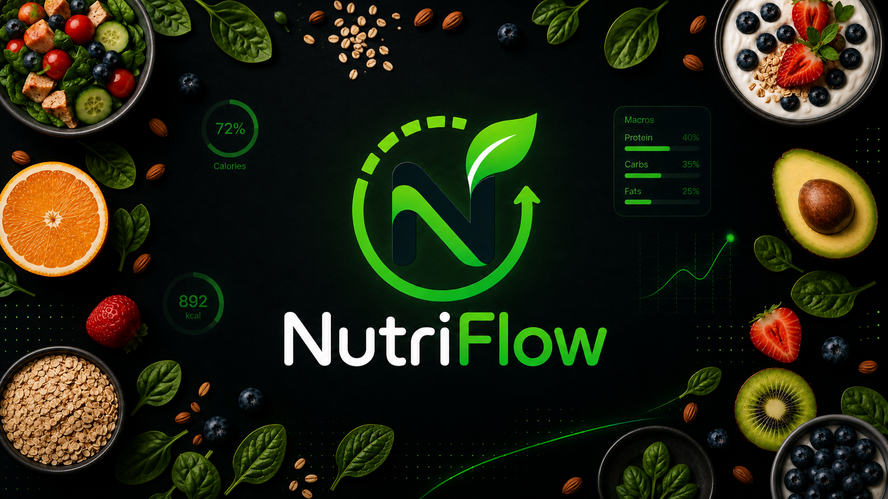

<p align="center">
  
</p>

<p align="center">
  <strong>Nutrición, hábitos y progreso en una experiencia móvil full-stack.</strong>
</p>

<p align="center">
  
  
  
</p>

<p align="center">
  <a href="https://github.com/Jairo0811/NutriFlow/actions/workflows/ci.yml">
    
  </a>
  
  
</p>

<p align="center">
  <strong>React Native · Expo · TypeScript · ASP.NET Core · EF Core · PostgreSQL · Docker · GitHub Actions</strong>
</p>

> **Snapshot de portafolio:** NutriFlow v1.4.0 queda congelado como versión funcional y demostrable del proyecto. No representa un lanzamiento comercial en App Store/Google Play ni implica que billing, credenciales externas o infraestructura productiva estén conectados.

---

## Descripción

**NutriFlow** es una aplicación móvil de seguimiento nutricional que permite crear un perfil nutricional, calcular objetivos diarios, registrar comidas, consultar calorías y macronutrientes, escanear productos, gestionar alergias y restricciones, seguir el progreso corporal y utilizar funciones asistidas por IA.

La aplicación actual fue desarrollada como implementación full-stack real a partir de un **prototipo académico de 2024** que originalmente consistía en mockups y flujo visual, sin backend ni aplicación funcional.

---

## Alcance congelado — v1.4.0

| Área | Estado |
|---|:---:|
| Authentication & Identity | ✅ |
| Onboarding nutricional obligatorio | ✅ |
| Nutrition Engine | ✅ |
| Food Catalog | ✅ |
| Meal Tracking | ✅ |
| Dashboard diario | ✅ |
| Barcode Scanner | ✅ |
| Progress / historial de peso | ✅ |
| Allergies & Preferences | ✅ |
| Freemium Foundation | ✅ |
| Usage Limits & Feature Gates | ✅ |
| Engagement & Retention | ✅ |
| Premium Analytics | ✅ |
| Micronutrients | ✅ |
| NutriFlow AI | ✅ |
| Icono + splash nativo | ✅ |
| EAS Build configuration | ✅ |
| CI API + Mobile | ✅ |

### Funciones principales

- registro e inicio de sesión con JWT + refresh tokens;
- Google authentication soportada mediante backend;
- onboarding nutricional con reanudación si queda incompleto;
- cálculo de TMB, TDEE, calorías objetivo y macronutrientes;
- unidades de interfaz en pies/pulgadas y libras;
- catálogo de alimentos y porciones;
- registro y edición de comidas;
- iconos por tipo de comida;
- dashboard diario de consumo y valores restantes;
- cámara para escaneo de códigos de barras;
- progreso de peso e historial;
- alergias, restricciones y preferencias alimentarias;
- advertencias de seguridad alimentaria no bloqueadas por paywall;
- engagement y métricas premium;
- análisis de micronutrientes;
- NutriFlow AI con Coach, Meal Photo y Voice Logging;
- confirmación explícita antes de registrar comidas propuestas por IA;
- validación de alimentos sugeridos por IA contra alergias/restricciones;
- branding nativo con icono y splash;
- perfiles EAS `preview` y `production`.

---

## NutriFlow AI

La IA se integra **del lado del servidor**. La aplicación móvil nunca recibe una API key de OpenAI.

Capacidades de la versión congelada:

- **AI Coach** para consultas nutricionales contextuales;
- **Meal Photo AI** para extraer alimentos desde una imagen;
- **Voice Logging** a partir de texto dictado por el usuario;
- mapeo de alimentos detectados hacia el catálogo interno;
- validación de seguridad antes del registro;
- confirmación del usuario antes de persistir una comida.

Cuotas configuradas:

| Plan | AI requests / mes |
|---|---:|
| Free | 5 |
| Premium | 100 |

> La arquitectura de planes está implementada, pero el proveedor de billing no está conectado en este snapshot; las cuentas reales permanecen en el plan Free hasta integrar un proveedor de suscripciones.

---

## 🧱 Stack tecnológico

### 📱 Mobile / Frontend

<p>
  
  
  
  
</p>

| Área | Tecnología |
|---|---|
| Framework | React Native 0.86 |
| Plataforma | Expo SDK 57 |
| Lenguaje | TypeScript 6 |
| Navegación | Expo Router |
| Cámara | Expo Camera |
| Sesión local | Expo SecureStore |
| OAuth | Expo AuthSession |
| Iconos | `@expo/vector-icons` |
| Builds | EAS Build |

### ⚙️ Backend / API

<p>
  
  
  
  
</p>

| Área | Tecnología |
|---|---|
| Plataforma | .NET 10 |
| API | ASP.NET Core Web API |
| Arquitectura | Clean Architecture |
| Persistencia | Entity Framework Core + Npgsql |
| Autenticación | JWT + refresh tokens rotativos |
| IA | OpenAI Responses API vía proveedor server-side |
| Contrato HTTP | OpenAPI |

### 🤖 IA e integraciones

<p>
  
  
  
</p>

- OpenAI Responses API integrada exclusivamente desde el backend;
- AI Coach, Meal Photo y Voice Logging;
- Google authentication con validación server-side;
- JWT + refresh tokens rotativos;
- feature gates y cuotas de uso por plan.

### 🗄️ Datos

<p>
  
  
</p>

- PostgreSQL 17;
- Entity Framework Core + Npgsql;
- migraciones EF Core;
- persistencia de identidad, nutrición, comidas, progreso, engagement, analytics, micronutrientes y cuotas.

### 🧰 Infraestructura, builds y CI

<p>
  
  
  
</p>

- Docker Compose;
- Git + GitHub;
- GitHub Actions;
- configuración mediante variables de entorno;
- EAS `preview` y `production` para builds móviles.

---

## Arquitectura

```text
React Native + Expo
        │
        │ HTTPS / JSON
        ▼
NutriFlow.Api
        │
        ▼
Application
        │
        ▼
Domain
        ▲
        │
Infrastructure
   EF Core / PostgreSQL
        │
        └── OpenAI provider / integrations
```

`NutriFlow.Domain` permanece independiente de HTTP, persistencia y proveedores externos.

Documentación adicional: [`docs/architecture`](docs/architecture/README.md).

---

## API destacada

### Identity

```text
POST /api/auth/register
POST /api/auth/login
POST /api/auth/google
POST /api/auth/refresh
POST /api/auth/logout
POST /api/auth/forgot-password
POST /api/auth/reset-password
GET  /api/auth/me
```

### Nutrición y seguimiento

```text
GET  /api/onboarding/
PUT  /api/onboarding/physical-profile
PUT  /api/onboarding/activity
PUT  /api/onboarding/goal
PUT  /api/onboarding/preferences
PUT  /api/onboarding/restrictions
POST /api/onboarding/complete
GET  /api/nutrition/targets
GET  /api/foods/
GET  /api/foods/barcode/{barcode}
GET  /api/meals/
POST /api/meals/entries
GET  /api/dashboard/?date=YYYY-MM-DD
```

### IA

```text
GET  /api/ai/status
POST /api/ai/coach
POST /api/ai/meal-photo
POST /api/ai/voice-log
POST /api/ai/confirm-meal
```

---

## Calidad y CI

El pipeline de GitHub Actions valida ambos lados del sistema antes de integrar cambios en `main`.

### API

- restore;
- build Release;
- tests automatizados;
- validación de Docker Compose;
- build de la imagen Docker.

### Mobile

- instalación reproducible con `npm ci`;
- reporte de advisories high del toolchain;
- bloqueo de vulnerabilidades críticas;
- TypeScript type-check.

Los advisories conocidos del ecosistema Expo se revisan sin forzar upgrades incompatibles. Consulta [`SECURITY.md`](SECURITY.md).

---

## Branding y build móvil

La configuración de Expo incluye:

- `apps/mobile/icon.png` como icono de aplicación;
- `apps/mobile/splash-icon.png` mediante `expo-splash-screen`;
- `apps/mobile/eas.json` con perfiles `preview` y `production`;
- bundle identifier iOS: `com.jairomatias.nutriflow`;
- package Android: `com.jairomatias.nutriflow`.

El perfil `preview` está preparado para distribución interna. Un build instalable en un iPhone físico requiere las credenciales y el aprovisionamiento correspondientes de Apple.

---

## Ejecución local

### Requisitos

- .NET SDK 10;
- Node.js 24 + npm;
- PostgreSQL 17 o Docker;
- Expo compatible con SDK 57.

### Mobile

```bash
cd apps/mobile
npm ci
npx expo-doctor@latest
npm run typecheck
npx expo start -c
```

### Configuración

Usa `.env.example` como referencia y nunca publiques secretos reales.

Variables relevantes incluyen:

```text
EXPO_PUBLIC_API_URL=
EXPO_PUBLIC_GOOGLE_CLIENT_ID=
ConnectionStrings__NutriFlow=
Jwt__SigningKey=
OpenAI__ApiKey=
OpenAI__Model=
```

`OpenAI__ApiKey` es exclusivamente server-side y nunca debe exponerse mediante variables `EXPO_PUBLIC_*`.

---

## Origen académico

NutriFlow nació como proyecto de **Bases de Datos 1 (INF-164)** en la **Universidad APEC (UNAPEC)** durante el período **mayo–agosto de 2024**.

| Información | Detalle |
|---|---|
| Asignatura | Bases de Datos 1 (INF-164) |
| Profesor | Ing. Pedro José Ramirez Rodriguez |
| Institución | Universidad APEC (UNAPEC) |
| Período | Mayo - Agosto 2024 |
| Entrega original | Mockups / prototipo visual |
| Aplicación funcional en 2024 | No |
| Implementación actual | Aplicación móvil full-stack desarrollada desde cero |
| Prototipo | [Figma — Daiet](https://www.figma.com/proto/Ww6fj3ebznHPc88hr48FSg/Daiet?node-id=0-1&t=U2MHmy9fFjnzx23I-1) |

### Equipo académico original

| Integrante | Matrícula |
|---|---|
| Luis Alberto Jimenez Perez | A00102205 |
| Charlie de Leon Duran | A00108707 |
| Francisca Mariela Hernández Melo | A00113127 |
| Francis Jairo Matías Rosario | A00115261 |

---

## Estado del proyecto

**NutriFlow v1.4.0 está congelado como snapshot de portafolio.**

Esto significa que el alcance actual se considera cerrado y estable para demostración, documentación académica y portafolio técnico. Las siguientes ideas quedan fuera de este snapshot y podrían retomarse únicamente como una evolución futura:

- Meal Planner + Shopping List;
- RevenueCat / billing real;
- publicación en App Store / Google Play;
- Apple Health / Health Connect;
- módulos para profesionales de nutrición.

No forman parte del cierre de v1.4.0.

---

## Licencia y uso

Proyecto de portafolio y evolución académica. Revisa el repositorio antes de reutilizar código, assets o branding en otros productos.
